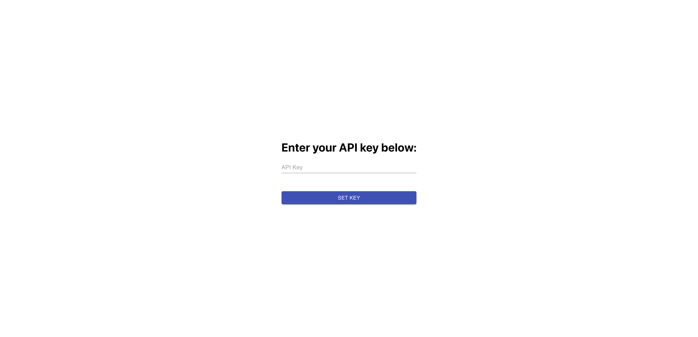
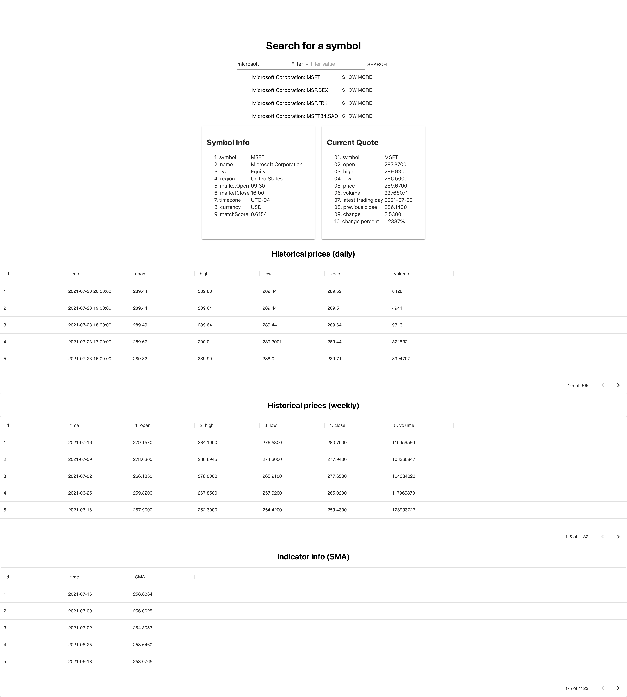

# COLMORE coding test
## Prerequisites
- yarn

## Overview
Frontend is a React web app which runs on localhost:3000

# Installation/setup
1. `cd ./frontend`
2. `yarn install`
3. `yarn start`
4. Navigate to `localhost:3000`
5. Enter an API key, generated from [https://www.alphavantage.co/support/#api-key](https://www.alphavantage.co/support/#api-key)
6. Enter a symbol (for example 'Microsoft'). Click Show More on a symbol to display more information. 

# Screenshots
## Homepage

## Query symbol page

# TODO
1. Improve UI using Material UI
2. Investigate caching 
3. Improve API user feedback with loading and error indicators
4. Provide charts and graphs for data analysis
